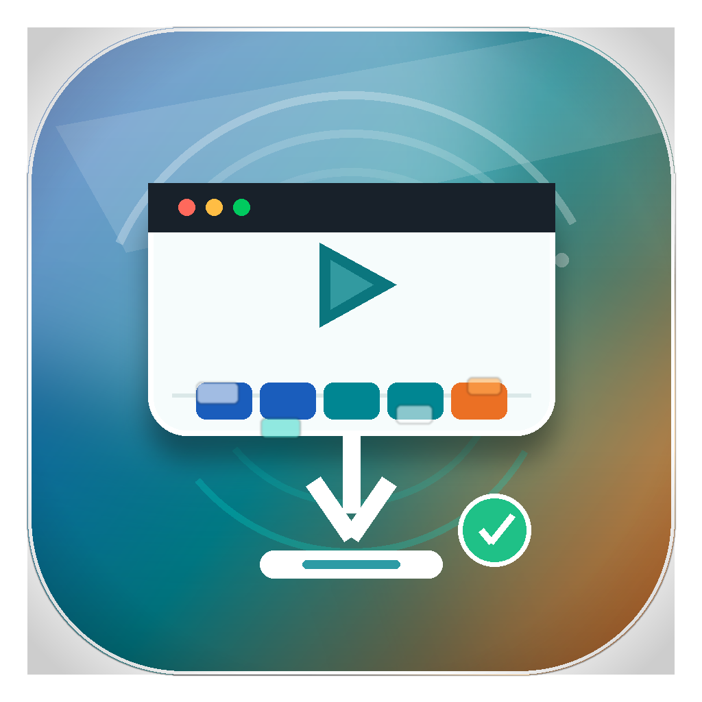

# Video Downloader

[](https://github.com/hyf751175784/video-downloader/actions/workflows/ci.yml)
[](#系统要求)
[](#技术栈)
[](#技术栈)
[](https://github.com/yt-dlp/yt-dlp)
[](https://ffmpeg.org)
[](LICENSE)

**一个原生 macOS 视频下载应用：输入网页地址，自动侦测可下载媒体，管理任务队列，并保存为 MP4、MKV、WebM 等常见视频文件。**

[English](README.md) · [架构文档](docs/ARCHITECTURE.md) · [敏捷日志](docs/AGILE_LOG.md)



## 为什么做它

很多视频网站并不会直接暴露一个简单的 `.mp4` 地址。真实情况往往更复杂：

- 视频是 HLS `.m3u8`，由很多分片组成。
- 播放地址由 JavaScript 动态生成。
- CDN 需要 Referer、Origin、Range 等浏览器请求头。
- 页面必须在真实浏览器里播放后才会出现媒体请求。
- 部分平台需要 Cookie、登录态、地区网络或会话状态。

Video Downloader 想把这些复杂性尽量收进一个简单流程：

```text
粘贴网页 -> 自动侦测 -> 选择清晰度 -> 下载 -> 校验可播放文件
```

它适合保存你拥有、制作、被授权或有权限下载的视频。不用于解密 DRM、绕过付费墙或突破平台访问控制。

## 功能亮点

- **原生 macOS 应用**：SwiftUI 界面，支持深色模式、快捷键、历史记录、设置页和 Finder 操作。
- **多层侦测引擎**：直接媒体地址、yt-dlp、HTML/iframe 扫描、Playwright 抓取、Chrome/CDP 抓包，以及可见浏览器捕获。
- **支持 HLS/DASH**：识别 `.m3u8` 分片流，下载分片，合并音视频轨道，输出完整文件。
- **常见输出格式**：默认 MP4，也可以选择 MKV 或 WebM。
- **可播放性保护**：下载后用 ffprobe 检查；MP4 不兼容时可重新封装或转码为更适合 QuickTime 的 H.264/AAC。
- **任务中心**：批量加入队列、顺序下载、停止后恢复、失败任务重试、应用重启后恢复等待任务。
- **批量进度管理**：显示当前第几个、总体进度、阶段、速度、ETA、成功数、失败数和等待数。
- **代理与 Cookie**：可选代理；可复用 Chrome Cookie 处理需要登录态或浏览器会话的网站。
- **浏览器捕获模式**：打开受控 Chrome，播放页面视频后捕获真实媒体请求。
- **一键支持报告**：诊断页和失败页都能复制应用状态、队列数量、失败任务、最近历史、运行日志和诊断结果，方便排查问题。
- **输出目录兜底**：完成页和设置页都能直接打开保存目录，即使精确文件路径缺失或文件被移动也不至于卡住。
- **真实站点测试矩阵**：维护一组实际视频网站样例，轻量探测媒体，不下载完整视频。

## 使用体验

应用主界面围绕真实下载流程设计：

- 粘贴一个链接，或者一次粘贴多个链接。
- 查看自动排序后的媒体候选。
- 选择输出格式和清晰度。
- 立即下载，或者加入任务队列。
- 在进度控制台里看到侦测、下载、合并、转换、校验每个阶段。
- 从任务中心恢复中断任务、重试失败任务。

## 系统要求

- macOS 14.0 或更新版本
- Xcode 或 Xcode Command Line Tools
- [Homebrew](https://brew.sh)
- `ffmpeg`
- Python 3，由项目虚拟环境管理

## 快速开始

```bash
git clone https://github.com/hyf751175784/video-downloader.git
cd video-downloader

brew install ffmpeg
make install-deps
make run
```

构建后的应用在：

```text
build/VideoDownloader.app
```

生成可分发压缩包：

```bash
make package
```

产物会写入 `dist/VideoDownloader-<version>-macos-arm64.zip`，并生成对应的 `.sha256` 校验文件。

## 使用方法

### macOS 应用

1. 启动 `VideoDownloader.app`。
2. 粘贴一个网页链接，或一次粘贴多个链接。
3. 点击 **Detect**，或按 `Command + Return`。
4. 选择媒体候选和清晰度。
5. 立即下载，或把多个候选加入队列。
6. 打开任务中心查看进度、重试失败、继续下一项。
7. 用设置页（`Command + ,`）配置代理、Cookie、通知、输出格式、保持唤醒等选项。
8. 遇到网站或下载问题时，从诊断页或失败页复制支持报告，方便快速排障。

### 命令行

```bash
source venv/bin/activate

# 侦测网页视频
python3 backend/downloader.py detect "https://www.youtube.com/watch?v=..."

# 下载最佳质量
python3 backend/downloader.py download "https://www.youtube.com/watch?v=..."

# 下载复制出来的 m3u8，并保留原网页 Referer
python3 backend/downloader.py download \
  "https://cdn.example/video/index.m3u8" \
  best \
  --referer "https://site.example/watch/page"

# 指定输出容器
python3 backend/downloader.py download "https://example.com/watch" best --output-format mkv

# 复用 Chrome Cookie
python3 backend/downloader.py detect "https://example.com/watch" --cookies-from-browser chrome

# 诊断本地后端环境
python3 backend/downloader.py diagnose --output-dir ~/Downloads/VideoDownloader
```

## 测试

```bash
# 本地确定性测试
make test

# 只跑 Swift 状态与队列恢复测试
make test-swift

# 真实网站冒烟测试；受网络和网站实时状态影响
make test-live

# 对一个新网站做轻量探测，不下载完整视频
make test-url URL="https://example.com/watch/page"

# 过滤测试组、走代理，并在预期回归时失败
make test-live LIVE_ARGS='--group new-user-sites --proxy http://127.0.0.1:7890 --strict'
```

本地测试会覆盖紧凑队列恢复、多链接提取、直接媒体批量导入、单项侦测失败隔离、批量进度统计、精确重试、中断恢复、HLS 侦测、Referer/Origin 防盗链分片、ffmpeg 回退，以及 MP4/MKV 可播放性校验。

真实网站测试故意独立出来，因为外部站点会变化、限流、过期、地区限制或要求会话状态。测试矩阵会把结果分类为可下载媒体、需要引导、受保护/不支持、超时或失败。

## 持续集成

GitHub Actions 会在推送和 Pull Request 时运行确定性质量门禁：安装依赖、编译 Python 后端文件、运行 `make test`，并构建 macOS 应用包。真实网站测试保留为手动执行，因为外部站点状态波动很大。

CI 也会运行 `make package`，确保发布 zip 和校验文件路径持续可用。

## 工作原理

```text
SwiftUI 应用
  -> Python 后端
    -> yt-dlp 元数据提取
    -> HTML / iframe 扫描
    -> Playwright 或 Chrome 网络抓取
    -> yt-dlp + ffmpeg 下载、合并、封装、转换
  -> ffprobe 校验
  -> 保存到 ~/Downloads/VideoDownloader
```

更多实现细节见 [docs/ARCHITECTURE.md](docs/ARCHITECTURE.md)。

## 项目结构

```text
video-downloader/
├── VideoDownloader/              SwiftUI macOS 应用
│   ├── Sources/
│   │   ├── App.swift             应用入口
│   │   ├── ContentView.swift     主界面
│   │   ├── ViewModel.swift       状态、队列、Python 桥接
│   │   └── Models.swift          Codable 数据模型
│   └── Resources/                Info.plist 与图标资源
├── backend/
│   ├── downloader.py             侦测、捕获、诊断、下载
│   ├── network_sniffer.py        浏览器媒体请求抓取
│   ├── capture_proxy.py          本地捕获辅助
│   ├── live_site_test.py         真实网站冒烟测试
│   ├── self_test.py              本地 HLS 确定性测试
│   └── site_tests.json           网站样例矩阵
├── docs/
│   ├── ARCHITECTURE.md
│   └── AGILE_LOG.md
├── tests/
│   └── QueuePersistenceSelfTest.swift
├── Makefile
└── README.md
```

## 技术栈

| 层级 | 技术 |
| --- | --- |
| 应用界面 | SwiftUI、AppKit 集成 |
| 状态与任务编排 | Swift、Combine、UserDefaults 快照 |
| 侦测与下载后端 | Python 3 |
| 视频解析 | yt-dlp |
| 合并、封装、转码 | ffmpeg |
| 可播放性校验 | ffprobe |
| 浏览器抓取 | Playwright、Chrome/CDP |
| 自动化 | Makefile |

## 合规使用

请只用于保存你拥有、制作、获得授权或有权限下载的视频。请尊重版权、平台条款、账号规则和当地法律。Video Downloader 不解密 DRM，也不绕过访问控制。

## 贡献与提交

见 [CONTRIBUTING.md](CONTRIBUTING.md)。本仓库提交信息统一使用中英文双语：

```text
Improve task center recovery / 改进任务中心恢复能力
```

如果是网站下载失败，请使用 "Site download failure / 网站下载失败" issue 模板，并粘贴应用复制出来的支持报告。结构化信息能让真实站点修复快很多。

## 许可证

[MIT](LICENSE)
